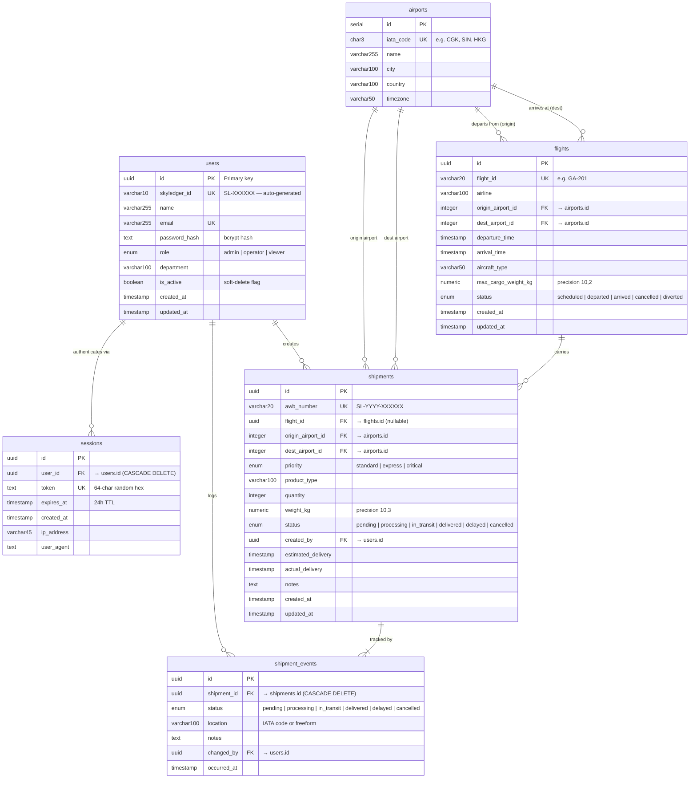
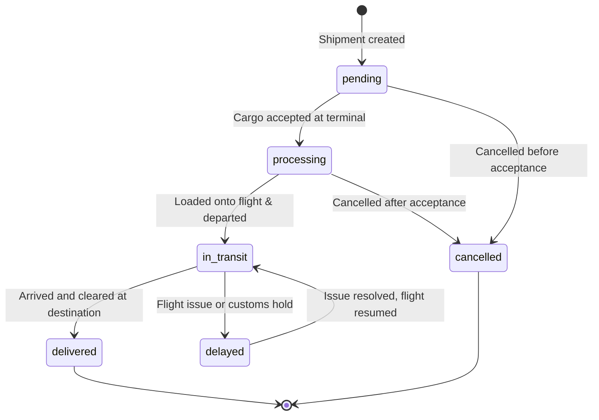

# SkyLedger — Database ERD



---

## Relationship Summary

| From | To | Cardinality | Notes |
|---|---|---|---|
| `users` | `sessions` | 1 → many | One user can have multiple active sessions |
| `users` | `shipments` | 1 → many | A user creates many shipments |
| `users` | `shipment_events` | 1 → many | A user can log many status changes |
| `airports` | `flights` | 1 → many | One airport is origin/dest for many flights |
| `airports` | `shipments` | 1 → many | One airport is origin/dest for many shipments |
| `flights` | `shipments` | 1 → many | One flight carries many shipments |
| `shipments` | `shipment_events` | 1 → many | Every shipment has at least one event (cascade delete) |

## Enum Values

| Column | Values |
|---|---|
| `users.role` | `admin` · `operator` · `viewer` |
| `flights.status` | `scheduled` · `departed` · `arrived` · `cancelled` · `diverted` |
| `shipments.priority` | `standard` · `express` · `critical` |
| `shipments.status` | `pending` · `processing` · `in_transit` · `delivered` · `delayed` · `cancelled` |
| `shipment_events.status` | _(same as shipments.status)_ |

---

## Type Legend

| Shorthand in diagram | Actual PostgreSQL type |
|---|---|
| `uuid` | `UUID` |
| `serial` | `SERIAL` (auto-increment integer) |
| `integer` | `INTEGER` |
| `boolean` | `BOOLEAN` |
| `text` | `TEXT` (unlimited length) |
| `timestamp` | `TIMESTAMP WITHOUT TIME ZONE` |
| `numeric` | `NUMERIC(precision, scale)` |
| `enum` | PostgreSQL custom ENUM type |
| `varcharN` | `VARCHAR(N)` |
| `char3` | `CHAR(3)` |

---

## Constraints & Defaults

### `users`
| Column | Constraint | Default |
|---|---|---|
| `id` | PRIMARY KEY | `gen_random_uuid()` |
| `skyledger_id` | UNIQUE · NOT NULL | — |
| `name` | NOT NULL | — |
| `email` | UNIQUE · NOT NULL | — |
| `password_hash` | NOT NULL | — |
| `role` | NOT NULL | `'operator'` |
| `is_active` | NOT NULL | `true` |
| `created_at` | NOT NULL | `now()` |
| `updated_at` | NOT NULL | `now()` |

### `sessions`
| Column | Constraint | Default |
|---|---|---|
| `id` | PRIMARY KEY | `gen_random_uuid()` |
| `user_id` | NOT NULL · FK · ON DELETE CASCADE | — |
| `token` | UNIQUE · NOT NULL | — |
| `expires_at` | NOT NULL | — |
| `created_at` | NOT NULL | `now()` |

### `airports`
| Column | Constraint | Default |
|---|---|---|
| `id` | PRIMARY KEY | auto-increment |
| `iata_code` | UNIQUE · NOT NULL | — |
| `name` | NOT NULL | — |

### `flights`
| Column | Constraint | Default |
|---|---|---|
| `id` | PRIMARY KEY | `gen_random_uuid()` |
| `flight_id` | UNIQUE · NOT NULL | — |
| `origin_airport_id` | FK → `airports.id` | NULL |
| `dest_airport_id` | FK → `airports.id` | NULL |
| `status` | NOT NULL | `'scheduled'` |
| `created_at` | NOT NULL | `now()` |
| `updated_at` | NOT NULL | `now()` |

### `shipments`
| Column | Constraint | Default |
|---|---|---|
| `id` | PRIMARY KEY | `gen_random_uuid()` |
| `awb_number` | UNIQUE · NOT NULL | — |
| `flight_id` | FK → `flights.id` · nullable | NULL |
| `origin_airport_id` | FK → `airports.id` · nullable | NULL |
| `dest_airport_id` | FK → `airports.id` · nullable | NULL |
| `created_by` | FK → `users.id` · nullable | NULL |
| `priority` | NOT NULL | `'standard'` |
| `status` | NOT NULL | `'pending'` |
| `created_at` | NOT NULL | `now()` |
| `updated_at` | NOT NULL | `now()` |

### `shipment_events`
| Column | Constraint | Default |
|---|---|---|
| `id` | PRIMARY KEY | `gen_random_uuid()` |
| `shipment_id` | NOT NULL · FK · ON DELETE CASCADE | — |
| `status` | NOT NULL | — |
| `changed_by` | FK → `users.id` · nullable | NULL |
| `occurred_at` | NOT NULL | `now()` |

---

## Recommended Indexes

| Table | Column(s) | Reason |
|---|---|---|
| `users` | `email` | Login lookup |
| `users` | `skyledger_id` | ID-based lookup |
| `sessions` | `token` | Validated on every authenticated request |
| `sessions` | `user_id` | Fetch all sessions per user |
| `sessions` | `expires_at` | Cleanup of expired sessions |
| `airports` | `iata_code` | IATA lookup when creating shipments |
| `flights` | `flight_id` | Flight lookup by code |
| `shipments` | `awb_number` | AWB lookup (public tracking page) |
| `shipments` | `status` | Filter by status on dashboard |
| `shipments` | `created_by` | Filter shipments per user |
| `shipments` | `flight_id` | List all cargo on a given flight |
| `shipments` | `created_at` | Time-range queries in reports |
| `shipment_events` | `shipment_id` | Fetch full audit trail per shipment |

> Drizzle ORM automatically creates UNIQUE indexes for `.unique()` columns. Add extra BTREE indexes via raw SQL migrations if needed.

---

## Shipment Lifecycle



Every transition inserts a new row into `shipment_events` — full, immutable audit trail.

---

## Data Flow Overview

```
 [Register / Login]
         │
         ▼
   users + sessions ──────────────────────────────────────┐
         │                                                 │
         ▼                                                 │
 [Create Shipment]                                         │
         │                                                 │
         ▼                                                 ▼
    shipments ──FK──► flights ──FK──► airports         sessions
         │                                            (auth guard)
         ▼
  shipment_events  ◄── appended on every status change
         │
         ▼
  [Reports API]  aggregates shipments + events → dashboard charts
```
